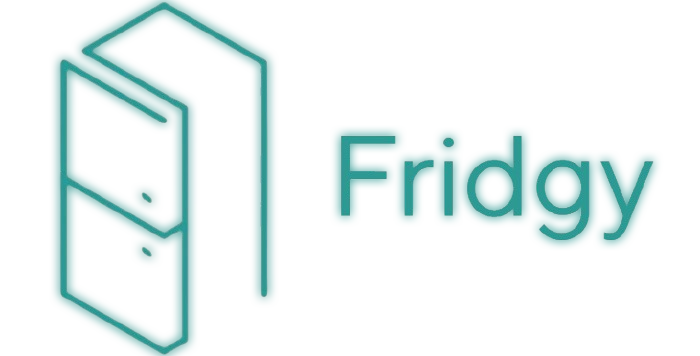

# Fridgy - Smart Food Management System

## Overview
Fridgy is a web application that helps users track food inventory, manage recipes, log meals, and monitor health metrics to reduce food waste and maintain a healthy lifestyle.

## Project Objectives
This project demonstrates best practices in software development:
- KISS, DRY, YAGNI, and separation of responsibilities principles
- Consistent naming conventions and code formatting
- Error handling and observability through logging
- Basic security practices
- Comprehensive testing approach

## Tech Stack
- **Backend**: Python 3.x with Flask
- **Frontend**: Vanilla JavaScript with HTML5/CSS3
- **Data Storage**: JSON file-based storage
- **Testing**: Pytest for backend

## Getting Started
### Prerequisites
- Python 3.8 or higher
- pip (Python package manager)
- Modern web browser (Chrome, Firefox, Safari, Edge)

### Backend Setup

1. **Clone the repository**
```bash
git clone 
cd fridgy
```

2. **Install backend dependencies**
```bash
cd backend
pip install -r requirements.txt --break-system-packages
```

Note: The `--break-system-packages` flag is required on Ubuntu 24.

3. **Start the server**

```powershell
python -m backend.server
```

### Testing the Application

1. **Add some food items**
   - Go to Food Storage page
   - Click "Add Food Item"
   - Fill in details (milk, apples, etc.)

2. **Create a recipe**
   - Go to Recipes page
   - Add a simple recipe using your food items

3. **Log a meal**
   - Go to Meal Tracker
   - Select foods from your inventory
   - View automatic nutrition calculation

4. **Check the dashboard**
   - View statistics and charts
   - See expiring foods warnings

### Running Tests
```bash
pytest backend/tests/ -v
```

All tests should pass:
```
test_health_check PASSED
test_add_and_get_food PASSED
test_delete_food PASSED
test_update_food PASSED
test_meal_nutrition_calculation PASSED
test_recipe_recommendations PASSED
```

## Features

### Food Storage Management
- Track food items across fridge, freezer, and shelf
- Monitor expiration dates with visual warnings
- Automatic expiry reminders for items expiring within 3 days
- Nutrition information per food item

### Recipe Management
- Save favorite recipes with ingredients and instructions
- Get recipe recommendations based on available ingredients
- Match score shows percentage of ingredients you have

### Meal Tracking
- Log meals with automatic nutrition calculation
- View daily nutrition breakdown by meal type
- Track calories, protein, carbs, and fats
- Meal history sorted by date and time

### Health Metrics
- Track weight, BMI, and cholesterol over time
- Visual trend charts for each metric
- 30-day historical data visualization

### Dashboard
- Overview of food inventory and expiring items
- Nutrition trends and calorie intake charts
- Meal distribution by type (breakfast, lunch, dinner, snacks)
- Configurable time period (7, 30, or 90 days)

## Troubleshooting

### Backend won't start
- Ensure port 8080 is not in use: `lsof -i :8080`
- Check Python version: `python --version` (should be 3.8+)
- Verify dependencies installed: `pip list | grep Flask`

### Frontend shows connection errors
- Ensure backend is running on port 8080
- Check backend logs for errors
- Clear browser cache and reload

### Charts not displaying
- Check browser console for JavaScript errors
- Ensure Chart.js CDN is accessible
- Try different browser

### Tests failing
- Ensure you're in the backend directory
- Check pytest is installed: `pip list | grep pytest`
- Run with verbose output: `pytest tests/ -v`

## Development

### Code Style
- Backend: Follow PEP 8, use Black formatter
- Frontend: Use Prettier, consistent indentation
- See CONVENTIONS.md for detailed guidelines

### Adding New Features
1. Create feature branch: `git checkout -b feat/feature-name`
2. Implement feature with tests
3. Update documentation
4. Create pull request with clear description

### Git Workflow
- `feat/` for new features
- `fix/` for bug fixes
- `docs/` for documentation
- See CONVENTIONS.md for commit message format

### Prerequisites
- Python 3.8 or higher
- pip (Python package manager)
- Modern web browser

## Project Structure
```
Fridgy/
├── backend/
│   ├── app.py              # Flask application setup
│   ├── data_service.py     # Data persistence layer
│   ├── routes/             # API route blueprints
│   └── tests/              # Backend tests
├── frontend/
│   ├── css/                # Stylesheets
│   ├── js/                 # JavaScript modules
│   └── *.html              # HTML pages
└── docs/                   # Additional documentation
```

## Team Conventions
See [CONVENTIONS.md](CONVENTIONS.md) for detailed coding standards.

## Testing
```bash
cd backend
pytest tests/
```

## Contributing
1. Create a feature branch from `main`
2. Follow naming conventions in CONVENTIONS.md
3. Write tests for new features
4. Submit a pull request with clear description
